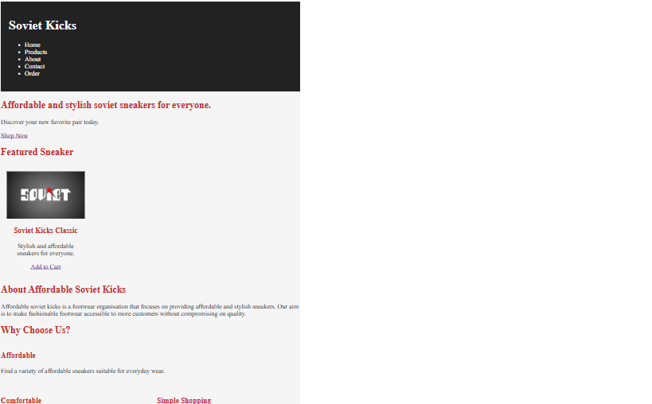
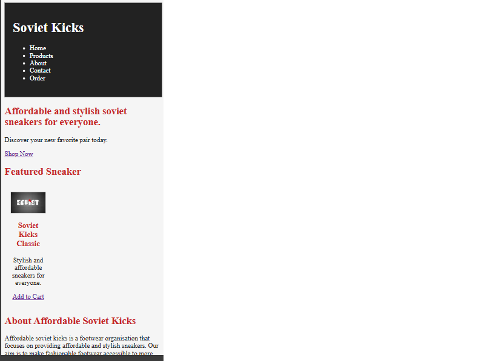

# Affordable Soviet Kicks

## Student Information

**Student Name:** [onica phiri]  
**Student Number:** [ST10502536]  
**Course/Module:** [Diploma in (IT) DISD0601]  
**Submission:** Part 1

## Project Overview

Affordable Soviet Kicks is a sneaker e-commerce website created to showcase affordable, stylish and comfortable sneakers. The website provides customers with information about the business, available products, prices, ordering options and contact details.

The website was developed using HTML and CSS. It includes product images, product information, an online order form, contact information and location images.

## Website Goals and Objectives

The main goal of the website is to create a simple and user-friendly online platform where customers can view affordable sneakers and find information about how to place an order.

The objectives are to:

- Showcase different Soviet Kicks sneakers.
- Provide product descriptions and prices.
- Allow customers to select a product, size and quantity.
- Provide contact information for customers.
- Display the business location.
- Create a professional and easy-to-use website.

## Key Features and Functionality

- Home page
- About Us page
- Products page
- Contact Us page
- Order/Shop page
- Product images
- Product prices and descriptions
- Product selection and shoe-size options
- Quantity selection
- Delivery address field
- Contact form
- Business location images
- Website navigation
- CSS styling and colour scheme

## Timeline and Milestones

### Part 1

- Created the website structure.
- Created the main HTML pages.
- Added product information and prices.
- Added sneaker images.
- Created the Order/Shop form.
- Created the Contact Us page.
- Added business location images.
- Added CSS styling.
- Created the README.md documentation.

### Part 2

Part 2 will include future updates and improvements to the website.

### Part 3

Part 3 will include further future updates and final improvements to the website.

## Part 1 Details

Part 1 focuses on creating the basic structure and functionality of the Affordable Soviet Kicks website. The website includes the main pages, product information, images, ordering functionality, contact information and initial styling.

Part 2 and Part 3 will follow in future submissions and will include additional edits, improvements and functionality.

## Sitemap

- Home
- About Us
- Products
- Contact Us
- Order/Shop

## Changelog

### Part 1

- Created initial website pages.
- Added navigation between website pages.
- Added sneaker product information.
- Added different sneaker images.
- Added product prices.
- Added an order form.
- Added contact information.
- Added business location images.
- Added CSS styling and colour scheme.
- Added styled product cards.
- Created README.md.

## Changelog

### Part 1
- Created initial website pages.
- Added navigation between website pages.
- Added sneaker product information.
- Added different sneaker images.
- Added product prices.
- Added an order form.
- Added contact information.
- Added business location images.
- Added CSS styling and colour scheme.
- Added styled product cards.
- Created README.md.

### Part 2 (Feedback Corrections from Part 1)
- **Added Planning Documentation:** Created a PART1 PLANNING.md file containing the complete project proposal, research evidence, sitemap, technical requirements, budget, and timeline.
- **Organised Project Files:** Moved all image files into a new images folder to establish a consistent file structure.
- **Updated HTML:** Corrected all image paths in the HTML files to link to the new images folder.

### Part 2 (CSS Styling Implementation)
- **Created External Stylesheet:** Created style.css and linked it to all HTML pages.
- **CSS Reset:** Added a basic reset (* { margin: 0; padding: 0; box-sizing: border-box; }) to ensure consistent styling across all browsers.
- **Typography:** Used CSS properties like font family, font-size, and line height to create a harmonious typography scale.
- **Layout Structure:** Used Flexbox (display: flex) for the Header navigation, the main content sections, and the footer.
- **Visual Styles:** Applied background-color, color, border, and box-shadow to style elements visually.
- **Interactive Elements:** Used the :hover and :active pseudo-classes on buttons and links to improve the user experience.
- **Responsive Design:** Added media queries for Tablet (max-width: 1024px) and Mobile (max-width: 768px). On mobile, the layout switches to a single-column design, and font sizes are adjusted for smaller screens.
## Responsive Screenshots

### Desktop View

### Tablet View

### Mobile View
